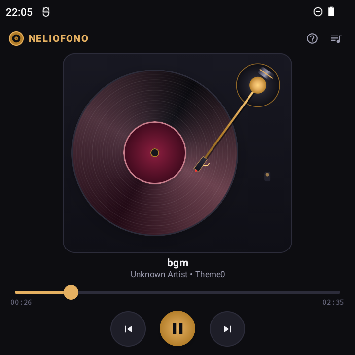
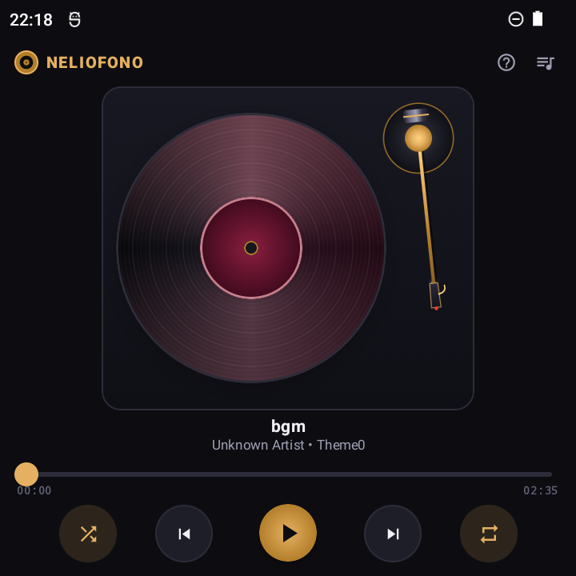
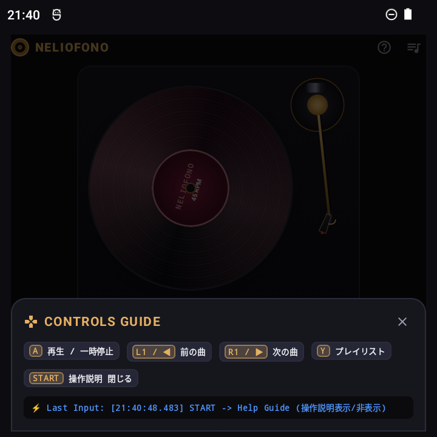

# Neliofono (ネリオフォノ) 🎵📀

**Neliofono（ネリオフォノ）** は、ANBERNIC RG Rotateをはじめとする物理コントローラー搭載デバイス特化のレコードプレーヤー風音楽再生Androidアプリです。

「Neliö（フィンランド語で四角・スクエア）」の画面の中で、レコード円盤が美しく回転・入れ替わるギミックと、物理ボタンによる完全なハンズフリー/ゲームパッド操作体験を提供します。

---

## 📸 スクリーンショット (Screenshots)

| 再生中 (Playback) | 一時停止中 (Paused) | 操作ガイド (START Modal) |
|:---:|:---:|:---:|
|  |  |  |
| **トーンアーム着地 & 60fps回転** Palette連動流線形レコード盤 | **アームレスト退避 & クリーンUI** 高級オーディオ機器ライクな佇まい | **STARTボタンで開くガイド** Bボタンで瞬時にクローズ |

---

## 🌟 特徴 (Features)

1. **RG Rotate 物理キー入力完全対応 (`KeyEventHandler`)**
   - フォーカス状態に依存せず、Activityレベルで直接物理キーイベントをインターセプト。
   - レコードプレーヤー操作（再生/停止、曲送り/戻し、プレイリスト表示切替、ガイド表示/Bボタンで閉じる）を物理ボタンに完全マッピング。

2. **リアルなターンテーブル幾何学 & トーンアーム連動 (`TonearmView`)**
   - 盤外のピボット（支点）から伸びる金属調トーンアーム＆カートリッジ。
   - **再生中**: 針先（スタイラス光）がレコード盤面の音溝に自然に着地して回転。
   - **停止中 / 曲切替時**: レコード盤から完全に離れ、右外側のアームレストへスムーズに退避。

3. **アルバムアート連動 動的レコード盤 (`DynamicVinylRecord`)**
   - アルバムアート・トラック情報から抽出した色彩（Palette API）による流線形スイープグラデーションと溝（Grooves）。
   - `Modifier.graphicsLayer { rotationZ = ... }` による60fps GPUアクセラレーション回転。

4. **5段階トラック切り替えアニメーション (`VinylAnimationCoordinator`)**
   - 物理キー（L1/R1、十字左右）および画面左右スワイプで発火。
   - 「①針退避 ➜ ②レコードスライドアウト ➜ ③曲・パレット色切り替え ➜ ④スプリングスライドイン ➜ ⑤針着地＆スピン再開」がシームレスに連動。

5. **高度なプレイリスト管理 & 編集・保存・ファイル追加機能**
   - **ファイル指定追加 (SAF)**: 「➕」ボタンから端末内の任意のフォルダ（DownloadやSDカード等）にある音源（MP3/FLAC等）を直接選択・即時追加。
   - **動的並び替え & 削除**: 「✏️」編集モードで「▲ 上へ」「▼ 下へ」「🗑 削除」により、再生を中断することなくExoPlayerのキューをシームレスに編集。
   - **プレイリスト保存 & 自動復元**: 編集状態は内部ストレージ（JSON）に即時自動セーブされ、次回起動時に完全復元。「💾 保存」で名前付きプレイリストとしての管理も可能。
   - **ライブラリ再スキャン**: 「🔄」ボタンで端末内の音源を一括再検出。

6. **多彩な再生モード（リピート / 1曲リピート / シャッフル）**
   - **リピート**: 通常再生（OFF）➜ 全曲ループ（ALL）➜ 1曲ループ（ONE）をスムーズに切り替え。
   - **シャッフル**: プレイリストをランダム再生。
   - 画面タップおよび **Xボタン**（リピート）・**SELECTボタン**（シャッフル）で瞬時に切替可能。

7. **洗練されたクリーンUI & START / B ボタン操作ガイド**
   - 通常画面は操作説明を非表示にし、高級オーディオ機器のような極上のデザイン。
   - **STARTボタン** を押すと操作ガイドモーダルをポップアップ表示。
   - **Bボタン** を押すと、開いている操作ガイドやプレイリストを瞬時にクローズ。

---

## 🎮 物理キーマッピング (RG Rotate Controls)

| ボタン / キー | 動作 (Action) |
|---|---|
| **A ボタン** / `MEDIA_PLAY_PAUSE` / `Space` | 再生 / 一時停止 (Play / Pause) |
| **B ボタン** / `BACK` / `ESC` | 閉じる / 戻る (Close Modal / Dismiss) |
| **R1 ボタン** / `DPAD_RIGHT` (十字右) | 次の曲 (Next Track: 針退避＆スライドアニメーション) |
| **L1 ボタン** / `DPAD_LEFT` (十字左) | 前の曲 (Previous Track: 針退避＆スライドアニメーション) |
| **X ボタン** / `R` | リピートモード切替 (OFF ➜ 全曲リピート ➜ 1曲リピート) |
| **SELECT ボタン** / `S` | シャッフル切替 (Shuffle ON / OFF) |
| **Y ボタン** | プレイリスト表示切替 (Toggle Playlist) |
| **START ボタン** | 操作ガイド表示 / 非表示 (Toggle Controls Guide) |

---

## 🛠 技術スタック (Tech Stack)

- **Language**: Kotlin 1.9.23
- **UI Framework**: Jetpack Compose (Material 3)
- **Architecture**: MVVM + StateFlow / MVI Event Driven
- **Media Engine**: AndroidX Media3 (ExoPlayer 1.3.1, MediaSession)
- **Image & Palette**: Coil 2.6.0, AndroidX Palette 1.0.0
- **Min SDK**: 26 (Android 8.0 Oreo) / **Target SDK**: 34 (Android 14)
